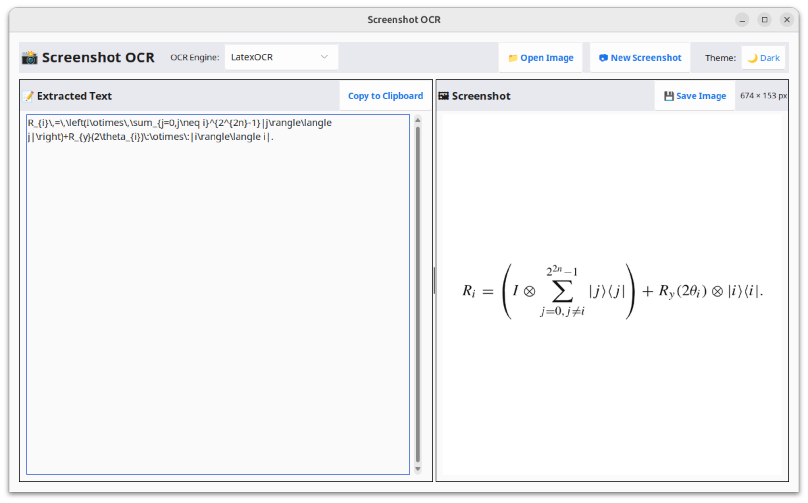
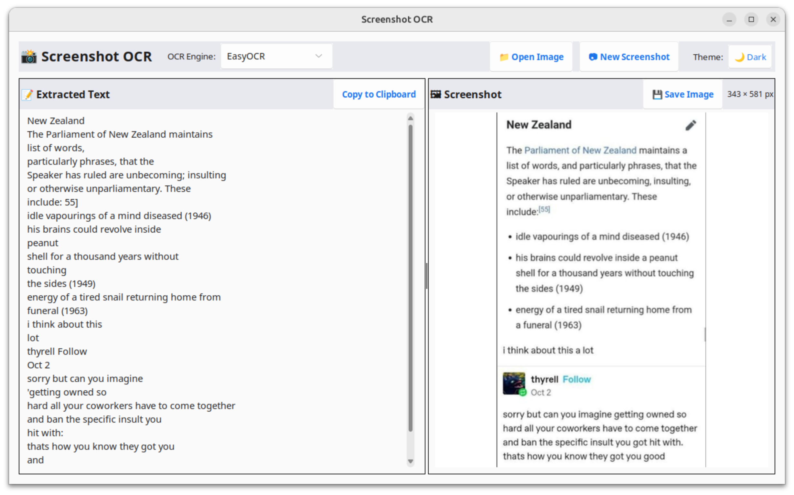

# Ubuntu Text Capture

A modern, Python-based OCR utility with a graphical interface to capture and extract text (including LaTeX math!) from your screen or images.

> 🧭 **Inspired by** [edwineas/ubuntu-text-capture](https://github.com/edwineas/ubuntu-text-capture)  
> This project builds upon Edwin's original script by adding a full-featured GUI, multiple OCR engine support (including LaTeX), theme toggling, and cross-platform compatibility.
---

## ✨ Features

- 📸 Capture screen region or open an image
- 🧠 Extract text using:
  - EasyOCR
  - PyTesseract
  - **LaTeX OCR** (`pix2tex`) — for mathematical expressions!
- 🌗 Toggle between light and dark themes
- 🖥️ Clean, responsive GUI with real-time feedback
- 📋 Automatically copies recognized text to clipboard
- 💾 Save screenshots or extracted image

---

## 🧠 OCR for Math? Absolutely.

This tool supports **LaTeX OCR**, allowing it to extract and render **mathematical equations** from handwritten or printed screenshots — perfect for students, researchers, and anyone dealing with math-heavy documents.

---

## 📷 Demo

### 🧮 Math Screenshot



### 📃 Simple Text Screenshot



---

## 🧰 Requirements

- Python 3.8+
- `Tesseract OCR`
- Optional: `pix2tex` (`LatexOCR`) for math equation support

---

## ⚙️ System Dependencies (Linux)

```bash
sudo apt update
sudo apt install gnome-screenshot tesseract-ocr libtesseract-dev xclip python3-venv
```

---

## 📦 Installation

### 1. Clone the repository

```bash
git clone https://github.com/r4j4-s/ubuntu-text-capture.git
cd ubuntu-text-capture
```

_or using SSH:_

```bash
git clone git@github.com:r4j4-s/ubuntu-text-capture.git
cd ubuntu-text-capture
```

### 2. Run the installer

```bash
sudo ./install.sh
```

This will:
- Create a Python virtual environment
- Install dependencies (e.g., `easyocr`, `pytesseract`, optional `pix2tex`)
- Create a launcher script: `text_capture.sh`

---

## 🚀 How to Use

### ▶️ Run from terminal

```bash
./text_capture.sh
```

A GUI will open where you can:
- Take a screenshot
- Open an image file
- Select an OCR engine
- View and copy extracted text

### ⌨️ Optional: Keyboard Shortcut (Linux)

Set up a shortcut like `Ctrl+Shift+T` to launch the app via:

1. **Settings → Keyboard → Custom Shortcuts**
2. Name: `Text Capture`
3. Command: `/full/path/to/text_capture.sh`
4. Shortcut: `Ctrl + Shift + T`

---

## 🔍 OCR Engine Options

You can select the OCR engine from the dropdown in the GUI:

| Engine       | Purpose                                         |
|--------------|--------------------------------------------------|
| EasyOCR      | General purpose text recognition                 |
| PyTesseract  | Fast, lightweight, uses Tesseract                |
| LaTeX OCR    | Recognizes mathematical expressions via `pix2tex`|

> ⚠️ Make sure Tesseract is installed and added to your system path.  
> LaTeX OCR requires installing `pix2tex` via `pip install pix2tex`.

---

## 💬 Support & Contributions

If you find this tool useful, please ⭐ the repo!  
It motivates further improvements and encourages open-source development.

Issues and PRs are welcome!

---

## 📄 License

MIT License – see the [LICENSE](./LICENSE) file for details.
